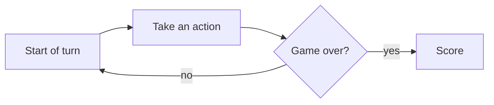

# <GAME NAME> — Rules

> This file has two jobs: it's the actual rulebook — something a person can
> read to learn how the game works — *and* it's a gate: no engine code gets
> written for this game until it's filled in, sourced, and checked off below.
> Write for both audiences. Plain language and an example beat precise jargon;
> a diagram beats a paragraph, if one would help.
>
> Don't fill this in from memory — cite where each rule actually came from.

## Status

- [ ] **Human verified** — check once you've compared everything below
  against a real source.
- **Sources** — at least one authoritative source (the official rulebook, if
  the game has one). A second independent source is great for catching
  transcription mistakes, especially on niche/unofficial or word-of-mouth
  games — but don't manufacture one that doesn't add anything.
  1. <title> — <url>

## Components & players

- Players: <n> (or a range, e.g. 2–4)
- Pieces/cards/tokens: <list with exact counts>

## Setup

<the exact starting position: hands, board, decks, face-up cards, who goes
first. Write it the way you'd explain it to someone about to play for the
first time.>

## Turn structure

<the sequence of a turn, broken into the smallest individual steps — e.g.
"play one card," "draw," "pass" — rather than "do several things at once."
Note any hand limits or forced draws. A flowchart or state diagram (see
Diagrams below) is often clearer here than prose.>

## Legal actions

<what moves are available on a normal turn, and any preconditions on them.
"Normal turn" = it's a player's turn to decide something — not a random event
(like a dice roll or card draw) and not after the game has already ended.>

## State transitions & special mechanics

<how each action changes the game state — chain reactions, ownership/control
changes, anything that needs to be re-checked after a change ripples through.
Walk through a concrete example rather than describing it abstractly, if the
mechanic is at all fiddly.>

## Chance & hidden information

- **Public** (everyone sees): <...>
- **Hidden** (each player only sees their own): <...>
- **Random events** (dice, draws, shuffles — and their odds): <...>

## Terminal conditions & scoring

<exactly how and when the game ends, and the exact scoring/win formula,
including tiebreakers. Use real numbers — "+1 / +2 / difference," not "some
points.">

## Diagrams (optional, but use them if they'd help)

<a board layout, a turn-flow state diagram, a small game tree — whatever
would help a reader picture the game faster than prose can. GitHub renders
Mermaid diagrams inline, e.g.:>



## GameSpec

```
name                  = "<game>"
num_players           = <n>
perfect_information   = <bool>
has_chance            = <bool>
zero_sum              = <bool>
num_distinct_actions  = <int>          # size of the whole action space
```

## Action encoding

<the fixed integer scheme mapping each action to a number, and how it adds up
to num_distinct_actions above. This needs to stay stable — tests and any
neural nets depend on it.>

## Worked example

<walk through one concrete position in plain language: what's the situation,
what moves are available, what happens if a specific move is played. This
doubles as a regression test once the engine exists.>

## Open questions

<anything you're not sure about yet — tag it `MUST-VERIFY` and don't write
engine code that depends on it until it's resolved against a real source.>

- [ ] **MUST-VERIFY —** <question>

## Checklist

- [ ] Every rule above cites a source.
- [ ] No open questions remain unresolved.
- [ ] GameSpec and action encoding are fully specified.
- [ ] A worked example is provided.
- [ ] Human verified, at the top.
