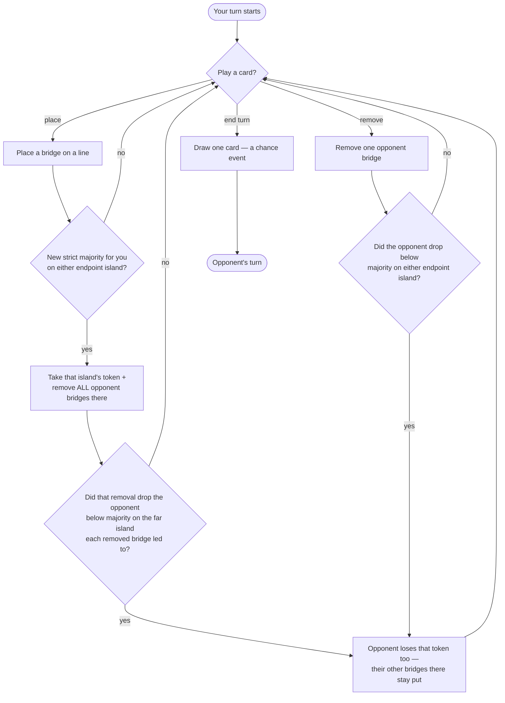

# Kahuna — Rules

> This file has two jobs: it's the actual rulebook — something a person can
> read to learn how the game works — *and* it's a gate: no engine code gets
> written for this game until it's filled in, sourced, and checked off below.
>
> Most of the rules below are already verified against the sources cited.
> **Two open questions remain and block engine coding** — resolve them
> against the physical rulebook before implementing `legal_actions` or
> scoring.

Kahuna is a 2-player board game about building bridges between islands to
take control of them. Taking one island can knock your opponent out of
control of a *neighboring* island too — not by flipping it to you outright,
but by leaving it uncontrolled and open for whoever moves in next. That
slow, multi-turn tug-of-war over newly-vulnerable islands is the interesting
part of the game.

## Status

- [ ] **Human verified** — check once you've compared everything below
  against a real source. *(Blocked right now — see Open questions.)*
- **Sources:**
  1. Official manual (Thames & Kosmos) — http://www.thamesandkosmos.com/manuals/full/691806_kahuna_manual.pdf
  2. UltraBoardGames rules — https://ultraboardgames.com/kahuna/game-rules.php
  3. BoardGameGeek — https://boardgamegeek.com/boardgame/394/kahuna

## Components & players

- **2 players.**
- **12 islands** connected by a fixed layout of bridge lines; each island has
  3–6 lines coming off it (the number is printed under the island's name on
  its card). Total bridge lines is about 24, but the exact count and layout
  still need tracing from the physical board — see Open question #1.
- **25 bridges + 10 control tokens per player.**
- **24 island cards** — 2 per island.

## Setup

- Each player starts with a hand of 3 cards.
- 3 cards are dealt face-up beside the board (public, and drawable).
- The rest of the deck forms a face-down draw pile.

## Turn structure

On your turn you can play any number of island cards (including zero), then
you must draw exactly one card. Hand limit is 5. `place` and `remove` are
each one atomic action, even though `remove` costs 2 cards at once:

- **`place(bridge_pos)`** — discard 1 card naming an island at either end of
  an empty bridge line, and place your bridge there.
- **`remove(bridge_pos)`** — remove one of your opponent's bridges, by
  discarding 2 cards, in one of two ways:
  - **Same island, twice:** discard 2 cards naming the *same* island to
    remove any one opponent bridge touching that island (your choice of
    which one, if they own more than one there).
  - **Two different islands:** discard 2 cards naming two *different*
    islands to remove the specific opponent bridge that directly connects
    those two islands (only legal if that exact bridge line exists and your
    opponent owns it).
- **`end_turn`** — stop playing cards for this turn; this is what triggers
  the draw.



After `end_turn`, the draw is a chance event — one card comes from the
face-down pile or possibly one of the 3 face-up cards (exactly how that
works is Open question #3) — and then it's the opponent's turn.

## State transitions & special mechanics (the core of the game)

This is the part that makes Kahuna interesting, so it's worth walking
through slowly:

- You **control** an island once you own a strict majority of its bridge
  lines (more than half — so on a 5-line island, 3 bridges is enough).
- The moment a `place` gives you a *new* strict majority on an island, two
  things happen at once: you take that island's control token, **and** every
  bridge your opponent owns touching that *one* island is immediately
  removed. This is the only way bridges get removed as a side effect of
  another action — it only ever hits the island you just took, never a
  neighbor.
- Removing those opponent bridges can still affect a neighboring island,
  because each removed bridge sits on a line that leads somewhere else too:
  if the opponent's count on that far island drops below strict majority as
  a result, **they simply lose their token there — nothing more.** Their
  other bridges on that island are untouched, and nothing gets
  auto-removed there. Losing majority costs you the token; it never costs
  you bridges by itself.
- That's *not* the cascade, even though it looks like the start of one — an
  island that just lost its token isn't captured by anyone, it's just open.
  The actual cascade plays out over **later turns**: since that island now
  has no majority holder, either player can place new bridges on its
  remaining free lines to claim it.
- **Dethroning is a risk, not a free gain.** Whoever reclaims that
  now-open island triggers the "take the token, strip the *other* player's
  remaining bridges there" event — and that cuts both ways. If you're the
  one who caused the opponent to lose their token there, you don't have
  first claim on it; if the opponent gets there first and builds their own
  new majority, it's now **your** bridges on that island that get stripped,
  not theirs. Knocking an opponent off an island opens a contested space
  that either side can end up winning — which is what keeps this a
  repeatable, turn-by-turn tug-of-war rather than a one-way ratchet in your
  favor, and why board position (who can reach a vulnerable island first)
  matters as much as the initial move that opened it up.
- Because one `place` only touches one line, and a line only has 2 endpoint
  islands, a single action can only ever directly change bridge counts on
  those 2 islands — so there's no wider board-wide sweep needed after a
  move, just a check of the (at most 2) islands whose bridge count just
  changed.
- Bridges and tokens are limited — 25 bridges and 10 tokens per player, total.
  Running out limits what you can still play.

## Chance & hidden information

- **Public**: the whole board (every bridge and who owns it), both players'
  placed tokens, the scores, which round it is, remaining bridge/token
  supplies, and the 3 face-up cards.
- **Hidden**: what's in each player's hand, and the order of the face-down
  pile.
- **Random events**: the end-of-turn draw.

## Terminal conditions & scoring

- A **scoring round** happens once the face-down pile is empty *and* the
  last of the 3 face-up cards has been drawn.
- After the 1st and 2nd scoring rounds: shuffle the discards into a new draw
  pile, deal 3 new face-up cards, and keep playing — players keep their
  current hands. The game ends after the 3rd scoring round.
- Points:
  - **1st scoring:** whoever controls more islands (by token count) gets +1.
  - **2nd scoring:** whoever controls more islands gets +2.
  - **3rd (final) scoring:** the leader's margin is the actual
    island/token difference between the two players.
  - **Tiebreak:** whoever has more bridges on the board; if still tied,
    nobody wins.
- Each player's final payoff is their net score difference (so the two
  payoffs always sum to 0).

## GameSpec

```
name                  = "kahuna"
num_players           = 2
perfect_information   = False
has_chance            = True
zero_sum              = True
num_distinct_actions  = 2 * <#bridge_pos> + 1     # place + remove per line, + end_turn  (≈ 49)
```

## Action encoding

Once the board graph is pinned down (Open question #1), the plan is a stable
integer scheme:
- `0 .. P-1` → `place(bridge_pos = i)`
- `P .. 2P-1` → `remove(bridge_pos = i - P)`
- `2P` → `end_turn`

where `P` is the number of bridge positions. `legal_actions()` filters these
down by: the line is free and you hold a card naming one of its endpoint
islands (`place`); your opponent owns that bridge and you hold either 2 cards
naming one of its endpoint islands, or 1 card naming each endpoint island
(`remove`); `end_turn` is always legal.

## Information-state tensor (for Deep CFR)

Per-bridge owner (3 possibilities × P positions) · per-island control, degree,
and each player's bridge count there · your hand, counted per island (12
numbers) · the 3 public face-up cards · cards seen/discarded so far this
round · bridges/tokens remaining · which round it is · scores · whether
you've already played a card this turn.

## Worked example

*(To fill in once the board graph exists — Open question #1.)* Should walk
through a small mid-game position: the board so far, the exact legal moves
available, and one placement that (a) gives you a new majority on an island,
(b) strips the opponent's bridges there, and (c) costs the opponent their
token on a neighboring island too (without touching their other bridges
there) — so this single-action side effect has a concrete regression test,
distinct from the later, separate turn where someone actually reclaims that
newly-uncontrolled neighbor.

## Open questions

- [ ] **MUST-VERIFY #1 — Exact board graph.** The full island adjacency and
  the exact count of bridge lines (`P`). This defines the whole action space
  — needs tracing directly from the physical board.
- [ ] **MUST-VERIFY #3 — Draw mechanics.** Can you draw from the 3 face-up
  cards as well as the face-down pile, and if a face-up slot is taken, how
  does it get refilled?

## Checklist

- [x] Every rule cites a source.
- [ ] No open questions remain unresolved. **(2 open — blocking)**
- [ ] GameSpec and action encoding are fully specified. *(waiting on #1)*
- [ ] A worked example is provided. *(waiting on #1)*
- [ ] Human verified, at the top.
