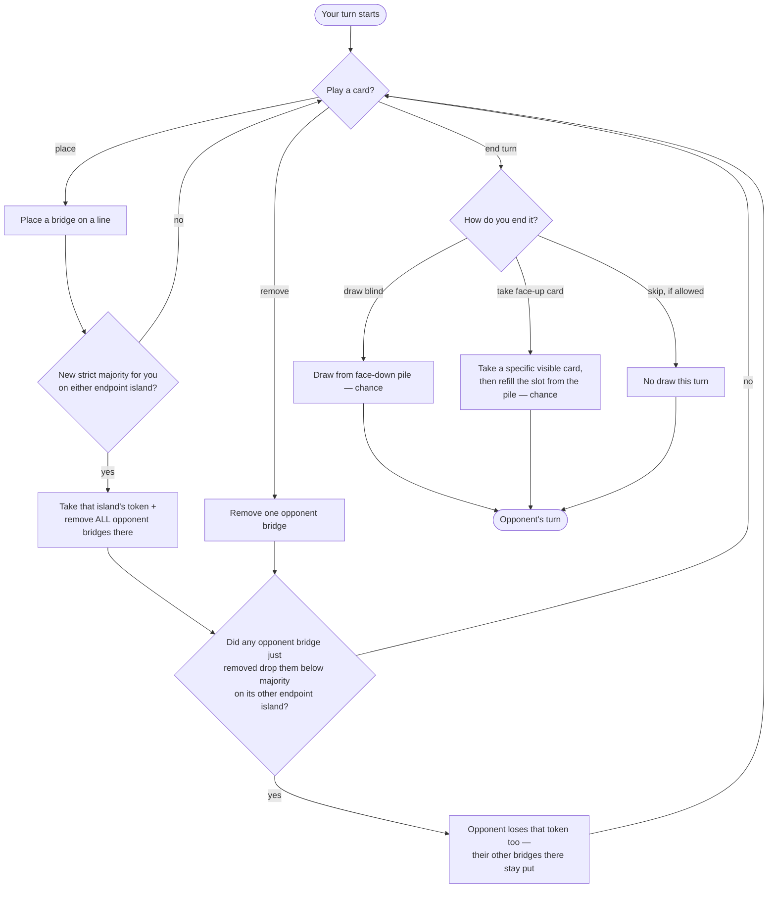

# Kahuna — Rules

> This file has two jobs: it's the actual rulebook — something a person can
> read to learn how the game works — *and* it's a gate: no engine code gets
> written for this game until it's filled in, sourced, and checked off below.
>
> Most of the rules below are already verified against the sources cited.
> **One open question remains and blocks engine coding** — resolve it
> against the physical rulebook before implementing `legal_actions` or
> scoring.

Kahuna is a 2-player board game about building bridges between islands to
take control of them. Taking one island can knock your opponent out of
control of a *neighboring* island too — not by flipping it to you outright,
but by leaving it uncontrolled and open for whoever moves in next. That
slow, multi-turn tug-of-war over newly-vulnerable islands is the interesting
part of the game.

## Status

- [ ] **Human verified** — check once you've compared everything below
  against a real source. *(Blocked right now — see Open questions.)*
- **Sources:**
  1. Official manual (Thames & Kosmos) — http://www.thamesandkosmos.com/manuals/full/691806_kahuna_manual.pdf
  2. UltraBoardGames rules — https://ultraboardgames.com/kahuna/game-rules.php
  3. BoardGameGeek — https://boardgamegeek.com/boardgame/394/kahuna

## Components & players

- **2 players.**
- **12 islands** connected by a fixed layout of bridge lines; each island has
  3–6 lines coming off it (the number is printed under the island's name on
  its card). Total bridge lines is about 24, but the exact count and layout
  still need tracing from the physical board — see Open question #1.
- **25 bridges + 10 control tokens per player.**
- **24 island cards** — 2 per island.

## Setup

- Each player starts with a hand of 3 cards.
- 3 cards are dealt face-up beside the board (public, and drawable).
- The rest of the deck forms a face-down draw pile.

## Turn structure

On your turn you can play any number of island cards (including zero), then
you end your turn by drawing or skipping (see below). `place` and `remove`
are each one atomic action, even though `remove` costs 2 cards at once:

- **`place(bridge_pos)`** — discard 1 card naming an island at either end of
  an empty bridge line, and place your bridge there.
- **`remove(bridge_pos)`** — remove one of your opponent's bridges, by
  discarding 2 cards, in one of two ways:
  - **Same island, twice:** discard 2 cards naming the *same* island to
    remove any one opponent bridge touching that island (your choice of
    which one, if they own more than one there).
  - **Two different islands:** discard 2 cards naming two *different*
    islands to remove the specific opponent bridge that directly connects
    those two islands (only legal if that exact bridge line exists and your
    opponent owns it).
- **Ending your turn** — one of:
  - **Draw blind** from the face-down pile (a chance event: the pile's
    order is hidden).
  - **Take a specific face-up card** (you can see all 3, so this is a
    deliberate pick, not chance). Immediately refill that now-empty slot by
    flipping the top card of the face-down pile face up — a chance event,
    since the pile's order is hidden, but it happens right away, not on a
    later turn.
  - **Skip** — end your turn without drawing at all. Only legal if your
    opponent did **not** also skip on their immediately preceding turn — two
    skips can't happen back-to-back.

Hand limit is 5.



## State transitions & special mechanics (the core of the game)

**The rules, stated directly:**

1. You **control** an island whenever you currently own a strict majority of
   its bridge lines — strictly more than half, not just half. (5-line
   island: 3 bridges. 4-line island: also 3, not 2 — an even split isn't a
   majority for either side.) This isn't a flag that gets set once and then
   sticks; it's just whatever the current bridge count says, checked fresh
   every time a bridge changes.
2. The moment a `place` is what pushes your count on an island past strict
   majority for the first time, you immediately take that island's control
   token, **and** every bridge your opponent owns touching that one island
   is removed at once.

That's the whole rule set for control. Everything below is a consequence of
those two rules, not an additional one.

**What follows from that:**

- Strict majority needs more than half of a *fixed* line count, so only one
  player can ever hold it on a given island. Control therefore never
  transfers directly between players in one step — an island is always
  controlled by exactly one player, or by nobody.
- Rule 2 only fires on a *new* majority, and per the point above that's only
  possible on an island nobody already controls (you can't out-place an
  opponent who still holds their majority-supporting bridges). So `place`
  only ever *creates* control — it can't take control away from an existing
  holder directly.
- `remove` — a direct action, or the side effect in rule 2 — only ever
  works the other way: it *destroys* control, by dropping someone's count
  below majority. It never hands control to anyone else in that same step.
- Rule 2's bridge removal can still ripple to a second island: each bridge
  it strips sits on a line with another endpoint elsewhere, so the
  opponent's count *there* drops by one too. If that drops them below
  majority, they lose that island's token as well — but nothing more: their
  other bridges there are untouched, and nothing else gets removed. Losing
  majority only ever costs the token, never bridges by itself.
- That leaves the far island uncontrolled, not captured. Reclaiming it is a
  separate, later action, open to *either* player — whoever gets there
  first with a new majority triggers rule 2 all over again on *that*
  island. This cuts both ways: dethroning your opponent doesn't give you
  first claim on what opens up — if they rebuild majority there first, it's
  your bridges that get stripped next. That repeatable, symmetric risk over
  whichever islands are currently vulnerable is what makes board position
  matter, not a single move triggering an instant chain reaction.
- Mechanically: `place` and `remove` each touch exactly one line, and a
  line has exactly two endpoint islands — so a single action can only ever
  directly change bridge counts on those two islands. No board-wide sweep
  is needed after a move, just a check of the (at most two) islands whose
  count just changed.

Bridges and tokens are also a limited, shared supply — 25 bridges and 10
tokens per player, in total. Running out limits what you can still play.

## Chance & hidden information

- **Public**: the whole board (every bridge and who owns it), both players'
  placed tokens, the scores, which round it is, remaining bridge/token
  supplies, the 3 face-up cards, and whether the previous turn ended in a
  skip (needed to know if skipping is currently legal).
- **Hidden**: what's in each player's hand, and the order of the face-down
  pile.
- **Random events**: drawing blind from the face-down pile — whether as
  your own draw, or as the automatic refill after someone takes a face-up
  card. Taking a specific face-up card is a visible, deliberate choice, not
  a random event.

## Terminal conditions & scoring

- A **scoring round** happens once the face-down pile is empty *and* the
  last of the 3 face-up cards has been drawn.
- After the 1st and 2nd scoring rounds: shuffle the discards into a new draw
  pile, deal 3 new face-up cards, and keep playing — players keep their
  current hands. The game ends after the 3rd scoring round.
- Points:
  - **1st scoring:** whoever controls more islands (by token count) gets +1.
  - **2nd scoring:** whoever controls more islands gets +2.
  - **3rd (final) scoring:** the leader's margin is the actual
    island/token difference between the two players.
  - **Tiebreak:** whoever has more bridges on the board; if still tied,
    nobody wins.
- Each player's final payoff is their net score difference (so the two
  payoffs always sum to 0).

## GameSpec

```
name                  = "kahuna"
num_players           = 2
perfect_information   = False
has_chance            = True
zero_sum              = True
num_distinct_actions  = 2 * <#bridge_pos> + 5   # place + remove per line,
                                                 # + draw-blind + 3 face-up picks + skip  (≈ 53)
```

## Action encoding

Once the board graph is pinned down (Open question #1), the plan is a
stable integer scheme:
- `0 .. P-1` → `place(bridge_pos = i)`
- `P .. 2P-1` → `remove(bridge_pos = i - P)`
- `2P` → end turn, draw blind from the face-down pile
- `2P+1 .. 2P+3` → end turn, take face-up slot `j` (`j` in 0..2)
- `2P+4` → end turn, skip the draw

where `P` is the number of bridge positions. (Exactly how face-up slots are
indexed as they get refilled is an implementation detail to pin down when
the engine is built, not a rules question.)

`legal_actions()` filters these down by: the line is free and you hold a
card naming one of its endpoint islands (`place`); your opponent owns that
bridge and you hold either 2 cards naming one of its endpoint islands, or 1
card naming each endpoint island (`remove`); draw-blind and each currently-
filled face-up slot are always legal; skip is legal only if the opponent's
immediately preceding turn wasn't itself a skip.

## Information-state tensor (for Deep CFR)

Per-bridge owner (3 possibilities × P positions) · per-island control,
degree, and each player's bridge count there · your hand, counted per
island (12 numbers) · the 3 public face-up cards · cards seen/discarded so
far this round · bridges/tokens remaining · which round it is · scores ·
whether you've already played a card this turn · whether the opponent
skipped their last turn (so you know if skipping is legal for you).

## Worked example

*(To fill in once the board graph exists — Open question #1.)* Should walk
through a small mid-game position: the board so far, the exact legal moves
available, and one placement that (a) gives you a new majority on an island,
(b) strips the opponent's bridges there, and (c) costs the opponent their
token on a neighboring island too (without touching their other bridges
there) — so this single-action side effect has a concrete regression test,
distinct from the later, separate turn where someone actually reclaims that
newly-uncontrolled neighbor.

## Open questions

- [ ] **MUST-VERIFY #1 — Exact board graph.** The full island adjacency and
  the exact count of bridge lines (`P`). This defines the whole action space
  — needs tracing directly from the physical board.

## Checklist

- [x] Every rule cites a source.
- [ ] No open questions remain unresolved. **(1 open — blocking)**
- [ ] GameSpec and action encoding are fully specified. *(waiting on #1)*
- [ ] A worked example is provided. *(waiting on #1)*
- [ ] Human verified, at the top.
