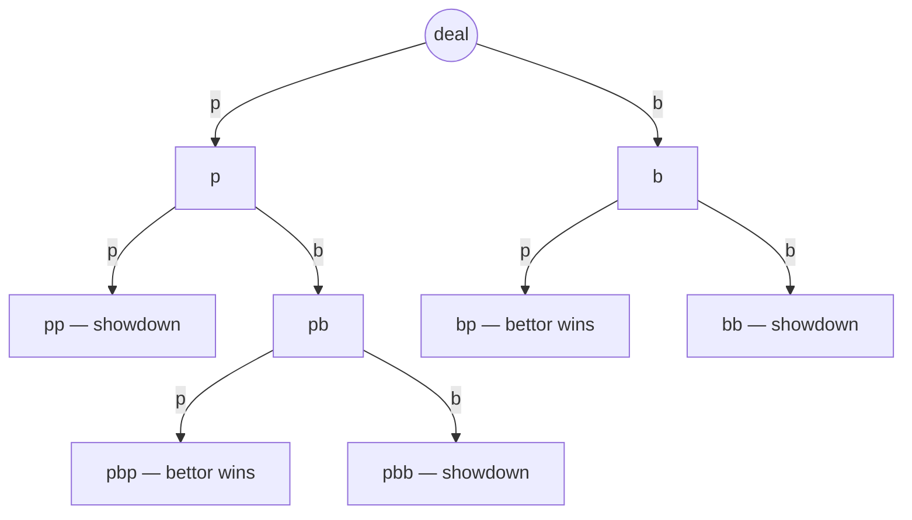

# Kuhn Poker — Rules

> This file has two jobs: it's the actual rulebook — something a person can
> read to learn how the game works — *and* it's a gate: no engine code gets
> written for this game until it's filled in, sourced, and checked off below.
>
> Don't fill this in from memory — cite where each rule actually came from.

Kuhn poker is a tiny, deliberately-simplified poker variant designed as a
minimal test case for game theory — not a game you'd actually sit down and
play for fun, but a good one to learn the rules format on.

## Status

- [x] **Human verified** — check once you've compared everything below
  against a real source.
- **Sources** — this is a fixed, universally-cited textbook game, so one
  primary source plus OpenSpiel's reference implementation (used here only to
  cross-check the engine, never as a game backend) is plenty:
  1. Kuhn, H.W. (1950), "A Simplified Two-Person Poker", *Contributions to the
     Theory of Games*, vol. 1, Annals of Mathematics Studies 24, Princeton
     University Press, pp. 97–103. (Original definition.)
  2. OpenSpiel game documentation — `kuhn_poker`:
     https://github.com/google-deepmind/open_spiel/blob/master/open_spiel/games/kuhn_poker/kuhn_poker.h

## Components & players

- Players: 2 (fixed).
- Cards: a 3-card deck, ranks {Jack, Queen, King} (J < Q < K), one of each.
- Chips: each player antes 1 chip per hand; a bet/call costs 1 additional chip.

## Setup

Each player antes 1 chip into the pot. The 3-card deck is shuffled; each
player is dealt 1 card face down (their private hand). The third card is
left unused. Player 0 acts first.

## Turn structure

A betting round of at most 2 rounds of action, in fixed turn order
(player 0 then player 1, repeating until the round ends). Each player acts
once per round with exactly one action:
- `pass` (check if no bet is outstanding, fold if a bet is outstanding)
- `bet` (bet 1 chip if no bet is outstanding, call if a bet is outstanding)

The round — and the hand — ends as soon as: both players have passed, a bet
has been called, or a pass follows a bet (fold). Nobody can act after that.

## Legal actions

On a normal turn (it's a player's decision, not the initial card deal) there
are always exactly 2 options: `pass` (0) and `bet` (1) — there are no raises,
no separate fold/call actions, and no draws.

## State transitions & special mechanics

The sequence of `pass`/`bet` actions so far (the "history") fully determines
where things stand — there's no other hidden state to track on the betting
side. There are exactly 5 possible histories before the hand ends:



No chain reactions or recomputation — each action just appends one symbol to
the history, and the terminal check above tells you if the hand is over.

## Chance & hidden information

- **Public**: the betting history (the sequence of `pass`/`bet` actions taken).
- **Hidden**: each player's own card — you don't learn your opponent's card
  until showdown.
- **Random events**: one deal at the start of the hand — 2 of the 3 cards go
  to the 2 players, all `3!/(3-2)! = 6` orderings equally likely.

## Terminal conditions & scoring

A hand ends, and each player's payoff is computed, at one of:
- **Fold** (a `pass` immediately follows a `bet`): the player who bet wins the
  pot. Winner gets `+1` (just the opponent's ante) if the fold happened before
  any bet was matched, or `+2` if a bet had already been placed.
- **Showdown** (`pp`, `bb`, or `pbb`): higher card wins the pot. Winner's net
  gain is `+1` after a `pp` showdown (nobody bet) or `+2` after a `bb`/`pbb`
  showdown (both bet); the loser's payoff is the same number, negated — the
  two payoffs always sum to 0.

## GameSpec

```
name                  = "kuhn"
num_players           = 2
perfect_information   = False
has_chance            = True
zero_sum              = True
num_distinct_actions  = 2          # pass=0, bet=1
```

## Action encoding

- `0` → `pass`
- `1` → `bet`

These are the only two actions in the game.

## Worked example

Say player 0 is dealt Q and player 1 is dealt K, and the hand goes `pb` —
player 0 passes, then player 1 bets. Now it's back to player 0, who can
either fold or call:
- **Fold** (`pass`): hand ends immediately, player 0 loses their ante,
  payoffs are `[-1, +1]`.
- **Call** (`bet`): hand goes to showdown at `pbb`. K beats Q, so player 1
  wins the bigger pot: payoffs are `[-2, +2]`.

## Open questions

*(none — this is a fixed, universally-cited textbook definition)*

## Checklist

- [x] Every rule above cites a source.
- [x] No open questions remain unresolved.
- [x] GameSpec and action encoding are fully specified.
- [x] A worked example is provided.
- [x] Human verified, at the top.
